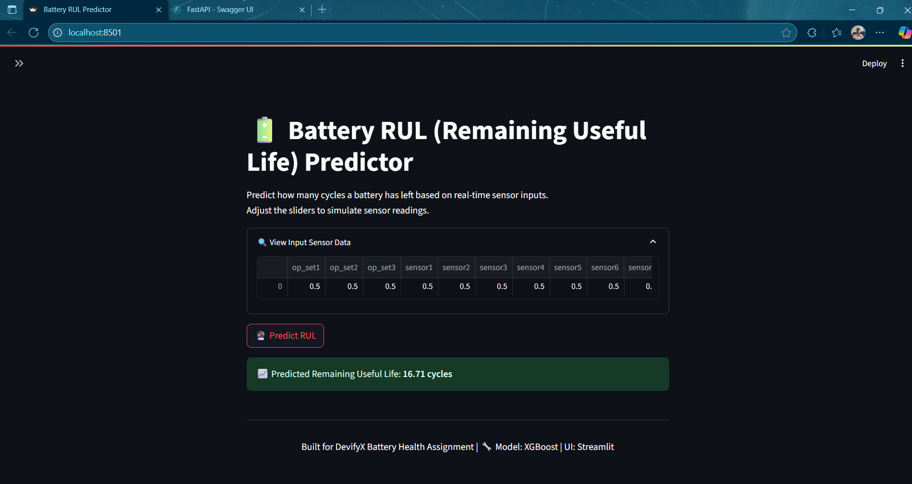

🔋 Battery Health Prediction – Remaining Useful Life (RUL)
DevifyX Assignment: End-to-End ML System
A complete machine learning pipeline to predict Remaining Useful Life (RUL) of batteries using time-series sensor data. Includes data preprocessing, model training (XGBoost), FastAPI deployment, Streamlit dashboard, and automation with Prefect.

🚀 Features
✅ Cleaned & preprocessed NASA CMAPSS data (FD001)

✅ Exploratory Data Analysis (EDA) on sensor degradation

✅ Feature engineering from sensor values

✅ Trained XGBoost regression model

✅ REST API for prediction using FastAPI

✅ Real-time interactive dashboard with Streamlit

✅ Hyperparameter tuning using Optuna

✅ Automated ML pipeline using Prefect

✅ Fully reproducible and GitHub-deployable structure

📁 Project Structure
battery-rul-predictor/
├── data/
│   ├── train_FD001.txt             # Raw NASA dataset
│   └── processed_FD001.csv         # Cleaned CSV for modeling
├── models/
│   └── xgb_rul_model.pkl           # Trained model file
├── notebooks/
│   ├── 01_EDA.ipynb
│   ├── 02_Preprocessing.ipynb
│   └── 03_ModelTraining.ipynb
├── api/
│   └── main.py                     # FastAPI backend
├── dashboard/
│   └── app.py                      # Streamlit frontend
├── pipeline/
│   └── pipeline.py                 # Prefect automation
├── tuning/
│   └── optuna_tune.py              # Optuna-based tuning
├── requirements.txt
├── README.md
└── .gitignore

📊 Dataset
Source: NASA CMAPSS (FD001 subset)

Download: train_FD001.txt

Each row contains:

unit, cycle, op_set1/2/3, sensor1 → sensor21

RUL target is computed per unit by reverse-counting cycles.

🔧 Setup Instructions
1. Clone the repo
bash
Copy
Edit

git clone https://github.com/ONKARJAMMA/BRUL.git
cd battery-rul-predictor
3. Create virtual environment
bash
Copy
Edit
python -m venv venv
venv\Scripts\activate  # On Windows
4. Install dependencies
bash
Copy
Edit
pip install -r requirements.txt
⚙️ How to Run
➤ Step 1: Preprocess Data (if needed)
bash
Copy
Edit
# Run notebook or use script
jupyter notebook notebooks/02_Preprocessing.ipynb
➤ Step 2: Train Model (XGBoost)
bash
Copy
Edit
jupyter notebook notebooks/03_ModelTraining.ipynb
➤ Step 3: Run FastAPI Backend
bash
Copy
Edit
cd api
uvicorn main:app --reload
Test it at:

➤ Step 4: Run Streamlit Dashboard
bash
Copy
Edit
cd dashboard
streamlit run app.py
➤ Step 5: Run Hyperparameter Tuning (Optional)
bash
Copy
Edit
python tuning/optuna_tune.py
➤ Step 6: Automate with Prefect (Optional)
bash
Copy
Edit
python pipeline/pipeline.py
